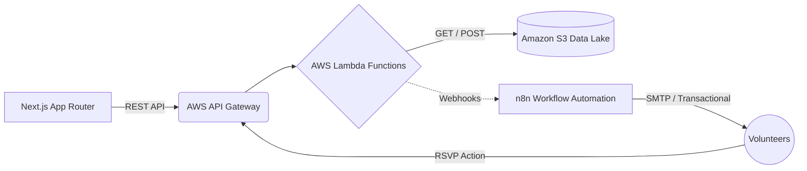

<div align="center">
  <h1>Gatherly</h1>
  <p><strong>A cloud-native volunteer management and event coordination platform.</strong></p>
  
  
  <br /><br />
  <p>
    <a href="#overview">Overview</a> •
    <a href="#core-features">Core Features</a> •
    <a href="#system-architecture">System Architecture</a> •
    <a href="#technology-stack">Technology Stack</a> •
    <a href="#local-setup">Local Setup</a>
  </p>
</div>

---

## Overview

**Gatherly** is a production-ready web application engineered to streamline community event coordination. Built entirely on a robust Serverless architecture, Gatherly automates the complex logistics of matching volunteer competencies to specific event requirements, handling RSVP workflows, and dispatching timely notifications. 

The application dynamically interfaces with an S3 Data Lake to filter volunteer registries, ensuring optimal resource allocation for specialized events without requiring manual intervention from organizers.

<br />

## Core Features

- **Algorithm-Driven Skill Matching**: Instantly parses the volunteer database and cross-references registered competencies with newly provisioned event schemas.
- **Asynchronous Workflow Automation**: Powered by n8n, Gatherly handles event-driven communications including interactive RSVP invitations, chronological reminders, and confirmation receipts entirely asynchronously.
- **Real-Time State Validation**: Features a highly responsive Next.js frontend that visually tracks dynamic event statuses (Open vs. Filled) and aggregates confirmed headcounts in near real-time.
- **Microservices-Based Serverless Backend**: Fully decoupled architecture utilizing AWS API Gateway and Lambda functions writing directly to an Amazon S3 backend, ensuring auto-scaling capabilities and minimal operational overhead.
- **Resilient UI Implementation**: Incorporates comprehensive loading states, error boundaries, and graceful fallbacks for a zero-friction user experience.

<br />

## System Architecture

Gatherly follows a modern decoupled architecture, enabling safe and performant communication between the Next.js client and AWS cloud infrastructure.



### Request Lifecycle
1. **Client Interaction**: Organizers construct events via the Next.js dashboard, dictating required capacities and target skillsets.
2. **Compute Layer**: `create_event.py` executes on AWS Lambda, persisting the document into the S3 bucket while actively scanning the `volunteers/registry.json` for optimal candidate matches.
3. **Event-Driven Execution**: External webhooks fire asynchronously, dispatching actionable HTML emails to the matched demographic via the n8n automation pipeline.
4. **State Reconciliation**: Volunteer confirmation actions trigger secondary API endpoints to update internal S3 allocation limits, instantly reflecting capacity changes on the client dashboard.

<br />

## Technology Stack

### Frontend Architecture
- **Framework:** [Next.js 16](https://nextjs.org/) (Utilizing App Router, Server, and Client Components)
- **Styling:** [Tailwind CSS](https://tailwindcss.com/)
- **UI Components:** [Lucide React](https://lucide.dev/)
- **Language:** TypeScript

### Cloud Infrastructure
- **Compute Services:** [AWS Lambda](https://aws.amazon.com/lambda/) (Python 3.10)
- **API Management:** [AWS API Gateway](https://aws.amazon.com/api-gateway/)
- **Object Storage:** [Amazon S3](https://aws.amazon.com/s3/) (JSON Document Store)
- **Data Orchestration:** [n8n](https://n8n.io/)

<br />

## Local Setup

To run the frontend dashboard locally for development:

**1. Clone the repository**
```bash
git clone https://github.com/yourusername/gatherly-app.git
cd gatherly-app/frontend
```

**2. Install Dependencies**
```bash
npm install
```

**3. Configure Environment Variables**
Rename `.env.example` to `.env.local` inside the `frontend` directory and define your AWS API gateway endpoint.
```env
NEXT_PUBLIC_API_URL=https://<your-api-id>.execute-api.ap-south-1.amazonaws.com/prod
```

**4. Start the Development Server**
```bash
npm run dev
```

<br />

---
<div align="center">
  <p>Engineered by Shreyas Hegde</p>
</div>
