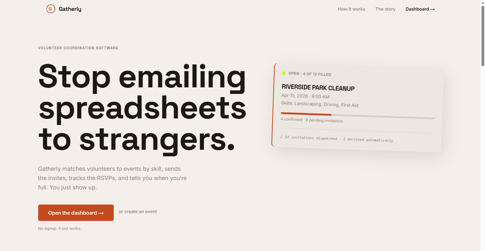
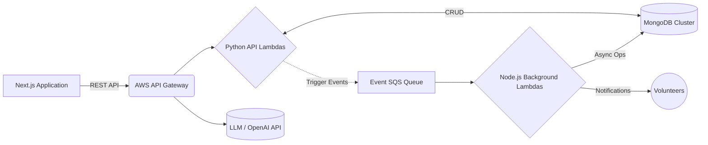

<div align="center">
  <h1>Gatherly</h1>
  <p><strong>A cloud-native, event-driven workflow automation platform for community coordination.</strong></p>
  
  
  <br /><br />
  <p>
    <a href="#overview">Overview</a> •
    <a href="#core-features">Core Features</a> •
    <a href="#system-architecture">System Architecture</a> •
    <a href="#technology-stack">Technology Stack</a> •
    <a href="#local-setup">Local Setup</a>
  </p>
</div>

---

## Overview

**Gatherly** is a production-ready workflow automation platform engineered to streamline community event coordination. Built entirely on an **Event-Driven Architecture (EDA)**, Gatherly uses trigger-based execution to automate the complex logistics of matching volunteer competencies to specific event requirements, handling RSVP workflows, and dispatching timely notifications. 

The platform leverages MongoDB for robust state management and integrates large language (LLM) APIs into its backend pipelines for intelligent decision-making and automated skill extraction.

<br />

## Core Features

- **Algorithm-Driven Skill Matching**: Instantly orchestrates NoSQL queries against embedded and LLM-normalized taxonomy within MongoDB to match event needs with active volunteers.
- **Trigger-Based Background Workflows**: Features asynchronous background processing pipelines using built-in AWS EventBridge and Node.js Lambdas, replacing monolithic synchronous API calls.
- **Intelligent LLM Automation**: Integrated LLM APIs (OpenAI) perform dynamic extraction of free-text volunteer bios to construct standardized skill sets autonomously.
- **Dynamic Auto-Scaling**: Engineered a highly resilient, event-driven serverless API using Python + AWS API Gateway capable of dynamically auto-scaling for high-throughput webhook ingestion without dropping events.
- **Real-Time State Validation**: Features a highly responsive Next.js frontend that visually tracks dynamic event statuses (Open vs. Filled) and aggregates headcounts instantly based on NoSQL aggregates.
- **Decoupled Datastore Integration**: Transitioned from blob-stores to Modeled MongoDB collections for efficient storage and sub-10ms transactional resolution of complex states.
- **Resilient Architectures**: Implemented comprehensive logging, synchronous acknowledgements, and asynchronous fault-tolerance/retries across all microservices.

<br />

## System Architecture

Gatherly follows a modern decoupled architecture, enabling safe and performant communication between the Next.js client and AWS cloud infrastructure.



### Request Lifecycle
1. **Event Ingestion**: Organizers and volunteers submit payloads via the Next.js client to structured RESTful endpoints on API Gateway.
2. **Synchronous Validation & LLM Pipeline**: Python lambdas parse the requests synchronously, leverage LLM APIs to standardize inputs, store them in MongoDB, and emit a background job trigger, returning a 2XX response immediately.
3. **Trigger-Based Execution**: Background queues (EventBridge/SQS) safely invoke the Node.js worker lambdas for heavy processing and AI skill matching.
4. **State Reconciliation**: Workflow executions directly mutate MongoDB document shapes asynchronously, instantly reflecting status changes in the frontend application via tracking endpoints.

<br />

## Technology Stack

### Frontend Architecture
- **Framework:** [Next.js 16](https://nextjs.org/) (Utilizing App Router, Server, and Client Components)
- **Styling:** [Tailwind CSS](https://tailwindcss.com/)
- **UI Components:** [Lucide React](https://lucide.dev/)
- **Language:** TypeScript

### Cloud Infrastructure
- **Compute Services:** AWS Lambda (Python 3.10 & Node.js 18)
- **API Management:** AWS API Gateway
- **Datastore:** MongoDB (Mongoose/PyMongo)
- **AI Automation:** OpenAI LLM APIs
- **Message Queues:** AWS SQS / EventBridge
- **Execution Tracking:** Built-in decoupled fault-tolerant async workflows.

<br />

## Local Setup

To run the frontend dashboard locally for development:

**1. Clone the repository**
```bash
git clone https://github.com/yourusername/gatherly-app.git
cd gatherly-app/frontend
```

**2. Install Dependencies**
```bash
npm install
```

**3. Configure Environment Variables**
Rename `.env.example` to `.env.local` inside the `frontend` directory and define your AWS API gateway endpoint.
```env
NEXT_PUBLIC_API_URL=https://<your-api-id>.execute-api.ap-south-1.amazonaws.com/prod
```

**4. Start the Development Server**
```bash
npm run dev
```

<br />

---
<div align="center">
  <p>Engineered by Shreyas Hegde</p>
</div>
